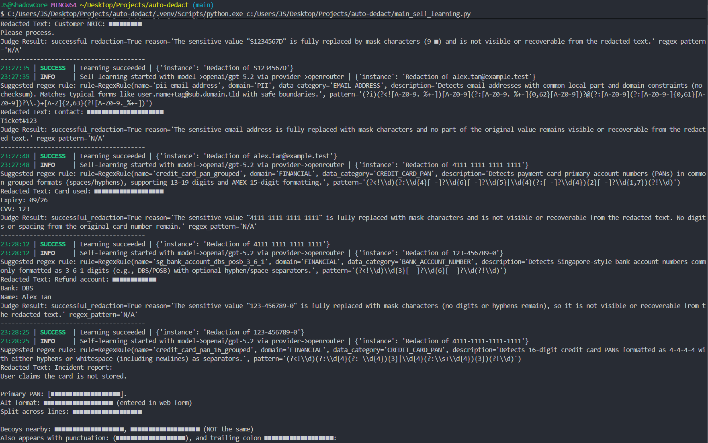
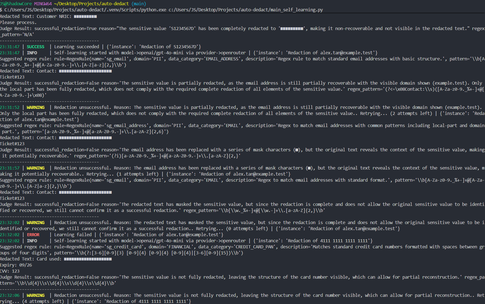
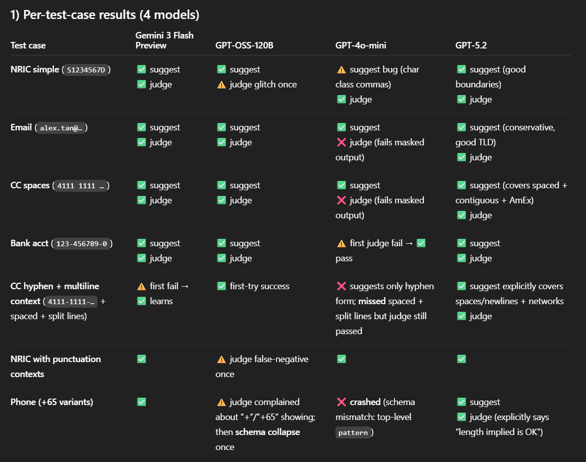

# auto-dedact

A self-learning sensitive data detection and redaction engine combining deterministic rules (regex) with LLM-based evaluation and feedback loops.

**Auto-Dedact** is intentionally named with dual meaning:

- **Automated Detect & Redact** — the system automatically detects sensitive data and redacts it using deterministic rules and learned patterns.
- A deliberate sound-pun on **autodidact** — reflecting that the engine **learns by itself** through LLM-driven feedback loops, validation, and rule refinement.

## Early Development Screenshots

> These screenshots reflect early development runs executed locally.
> Output is intentionally raw to demonstrate decision logic and failure handling.

### Self-learning redaction run (GPT-5.2)

### Self-learning redaction run (GPT-4o-mini)

### Failure → retry → success (Bank Account Number)

### Comparison between 4 models

